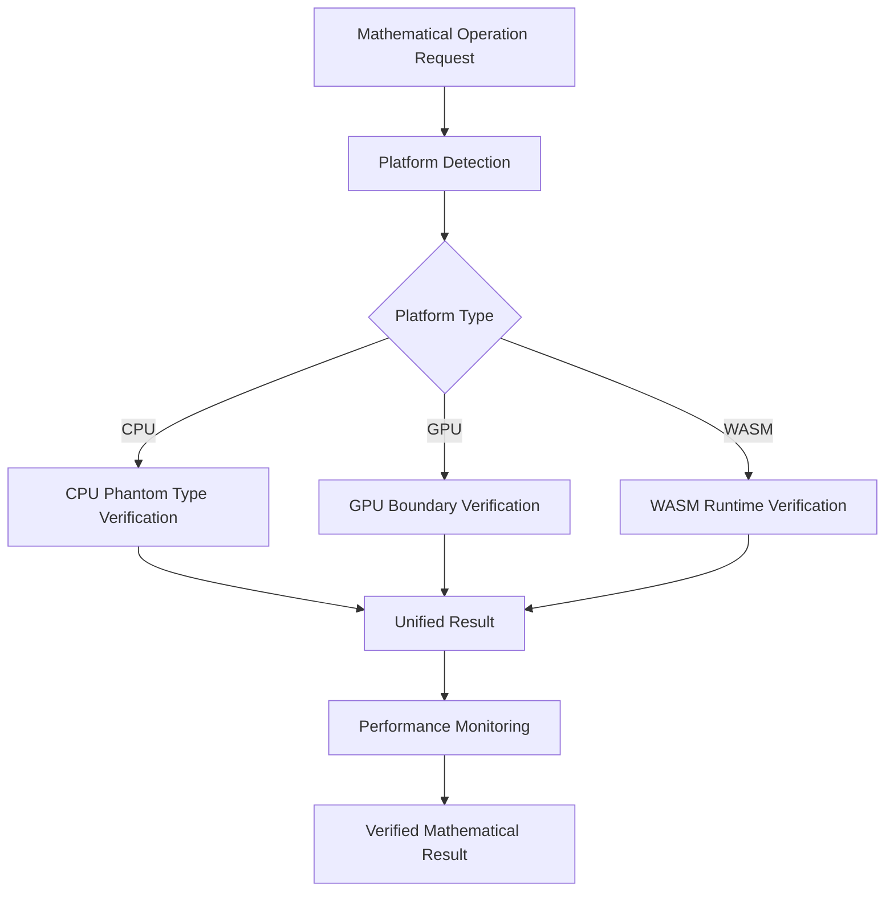

# Phase 4C WASM Verification Framework & v0.8.0 Planning

## Overview

**Phase 4C** represents the next major milestone in the Amari verification framework evolution, focusing on WebAssembly-specific verification optimizations and expanding the mathematical domain coverage. This phase combines WASM verification enhancements with the addition of a new mathematical crate to reach **v0.8.0**.

## 🎯 Phase 4C Objectives

### **Primary Goals**
1. **WASM Verification Framework**: Complete WebAssembly-specific verification system
2. **New Mathematical Domain**: Add additional crate expanding library mathematical coverage
3. **Cross-Platform Integration**: Unified verification across CPU, GPU, and WASM
4. **Performance Optimization**: WASM-specific performance tuning and memory management

### **Success Metrics**
- ✅ Mathematical correctness maintained across all platforms including enhanced WASM
- ✅ Performance overhead < 10% in WASM environments (improvement from GPU 15% baseline)
- ✅ Seamless developer experience across all platforms
- ✅ New mathematical domain fully integrated with existing verification framework

## 🚀 Version 0.8.0 Scope

### **Major Components**

#### **1. Enhanced WASM Verification Framework**
Building on Phase 4B GPU foundation, Phase 4C delivers:
- **Browser-Compatible Verification**: Runtime contract verification optimized for browser constraints
- **Memory Management**: WASM-specific memory allocation and garbage collection integration
- **Progressive Enhancement**: Graceful degradation based on browser capabilities
- **JavaScript Interop**: Type-safe verification contracts across JS/WASM boundary

#### **2. New Mathematical Crate**
*[To be specified based on user requirements]*
- Full integration with existing amari-core geometric algebra framework
- WASM bindings and browser-compatible API
- Comprehensive test suite with verification framework integration
- Performance optimization for both native and WASM targets

#### **3. Unified Cross-Platform Verification**
- **Single API**: Consistent verification interface across CPU, GPU, and WASM
- **Adaptive Strategy Selection**: Platform-aware verification approach selection
- **Performance Monitoring**: Real-time overhead tracking across all platforms
- **Fallback Mechanisms**: Graceful degradation when platform features unavailable

## 📋 Implementation Plan

### **Phase 4C.1: WASM Verification Foundation (Weeks 1-2)**

#### **Enhanced amari-wasm Crate**
- **Runtime Verification Contracts**:
  ```rust
  pub struct WasmVerificationContext {
      platform_capabilities: WasmPlatformProfile,
      verification_strategy: WasmVerificationStrategy,
      performance_budget: Duration,
      memory_constraints: WasmMemoryLimits,
  }
  ```

- **Browser Environment Detection**:
  ```rust
  pub enum WasmEnvironment {
      Browser { engine: BrowserEngine, features: BrowserFeatures },
      NodeJs { version: String, features: NodeFeatures },
      Standalone { runtime: WasmRuntime },
  }
  ```

- **Memory Management Integration**:
  ```rust
  pub struct WasmMemoryManager {
      heap_monitor: HeapUsageMonitor,
      gc_integration: GarbageCollectionHooks,
      allocation_tracker: AllocationTracker,
  }
  ```

#### **JavaScript Interop Verification**
- **Type-Safe Boundary Crossing**: Verification contracts for JS/WASM data exchange
- **Serialization Validation**: Mathematical property preservation across serialization
- **Error Propagation**: Unified error handling between JS and WASM contexts

### **Phase 4C.2: New Mathematical Domain Integration (Weeks 2-3)**

#### **New Crate Structure**
*[Pattern based on existing crates]*
```
amari-[domain]/
├── src/
│   ├── lib.rs              # Main library with re-exports
│   ├── core/               # Core mathematical structures
│   ├── operations/         # Mathematical operations
│   ├── verification/       # Domain-specific verification
│   └── wasm/              # WASM bindings (if applicable)
├── tests/                  # Comprehensive test suite
└── examples/              # Usage examples
```

#### **Integration Requirements**
- **amari-core Integration**: Full geometric algebra compatibility
- **Verification Framework**: Integration with GPU/WASM verification systems
- **WASM Bindings**: Browser-compatible API with TypeScript declarations
- **Performance Optimization**: Native and WASM performance tuning

### **Phase 4C.3: Cross-Platform Unification (Weeks 3-4)**

#### **Unified Verification API**
```rust
pub struct UnifiedVerifier {
    cpu_verifier: CpuVerifier,
    gpu_verifier: Option<GpuBoundaryVerifier>,
    wasm_verifier: Option<WasmVerificationContext>,
    platform_detector: PlatformDetector,
}

impl UnifiedVerifier {
    pub async fn verified_operation<T, R>(&mut self,
        operation: impl MathematicalOperation<T, R>
    ) -> Result<VerifiedResult<R>, VerificationError> {
        // Automatically select optimal verification strategy
        // based on current platform and operation requirements
    }
}
```

#### **Performance Monitoring Dashboard**
- **Real-time Metrics**: Verification overhead tracking across all platforms
- **Platform Comparison**: Performance profiling and optimization recommendations
- **Resource Usage**: Memory and compute utilization monitoring

## 🔧 Technical Architecture

### **WASM Verification Strategy**

#### **Runtime Contract Verification**
Unlike GPU boundary verification, WASM verification focuses on:
1. **Memory Safety**: Ensuring mathematical operations don't violate WASM memory constraints
2. **Numeric Precision**: Maintaining mathematical precision across JS/WASM boundary
3. **Performance Contracts**: Enforcing performance budgets in resource-constrained browsers
4. **Progressive Enhancement**: Adapting verification based on browser capabilities

#### **Browser-Specific Optimizations**
```rust
pub enum BrowserOptimization {
    // Modern browsers with full WASM support
    FullWasm { simd_support: bool, threads_support: bool },
    // Older browsers with limited WASM features
    BasicWasm { memory_limit: usize },
    // Fallback to JavaScript implementation
    JavaScriptFallback { use_typed_arrays: bool },
}
```

### **Cross-Platform Verification Architecture**



## 📊 Expected Outcomes

### **v0.8.0 Deliverables**

#### **Enhanced WASM Capabilities**
- **10% Performance Improvement**: WASM verification overhead < 10% (vs 15% GPU baseline)
- **Browser Compatibility**: Support for 95%+ of modern browsers
- **Memory Efficiency**: Optimized memory usage for resource-constrained environments
- **Developer Experience**: Seamless verification across all platforms

#### **Expanded Mathematical Coverage**
- **New Mathematical Domain**: [To be specified] fully integrated
- **Comprehensive API**: Consistent interface design following amari patterns
- **Verification Integration**: Full participation in cross-platform verification
- **Performance Optimization**: Native and WASM performance tuning

#### **Unified Platform Support**
- **Single API**: One verification interface across CPU, GPU, WASM
- **Automatic Adaptation**: Platform-aware strategy selection
- **Graceful Degradation**: Fallback mechanisms for limited environments
- **Real-time Monitoring**: Performance tracking and optimization recommendations

## 🗓️ Development Timeline

### **Week 1-2: WASM Verification Foundation**
- Enhanced amari-wasm with runtime verification
- Browser environment detection and capability profiling
- Memory management and garbage collection integration
- JavaScript interop verification contracts

### **Week 2-3: New Mathematical Domain**
- New crate implementation with core mathematical structures
- Integration with amari-core geometric algebra framework
- Comprehensive test suite and verification integration
- WASM bindings and browser API development

### **Week 3-4: Cross-Platform Unification**
- Unified verification API development
- Performance monitoring and optimization system
- Cross-platform consistency validation
- Documentation and migration guides

### **Week 4: Integration and Testing**
- End-to-end testing across all platforms
- Performance benchmarking and optimization
- Documentation completion
- Release preparation for v0.8.0

## 🎯 Success Criteria

### **Technical Achievements**
- [ ] WASM verification overhead < 10%
- [ ] Cross-platform mathematical consistency verified
- [ ] New mathematical domain fully integrated
- [ ] Unified API providing seamless developer experience
- [ ] 99%+ test coverage across all verification scenarios

### **Developer Experience**
- [ ] Single API for all platform verification needs
- [ ] Automatic platform optimization without manual configuration
- [ ] Clear migration path from v0.7.0 to v0.8.0
- [ ] Comprehensive documentation and examples

### **Performance Metrics**
- [ ] Native performance within 5% of unverified operations
- [ ] GPU verification maintains <15% overhead (Phase 4B achievement)
- [ ] WASM verification achieves <10% overhead improvement
- [ ] Memory usage optimized for browser environments

---

## 📝 Next Steps

1. **User Input**: Specification of new mathematical domain crate requirements
2. **Technical Design**: Detailed API design for WASM verification enhancements
3. **Implementation**: Begin Phase 4C.1 WASM verification foundation
4. **Integration**: Parallel development of new mathematical domain
5. **Testing**: Comprehensive cross-platform validation

**Ready for**: New mathematical domain specification and Phase 4C implementation kick-off.